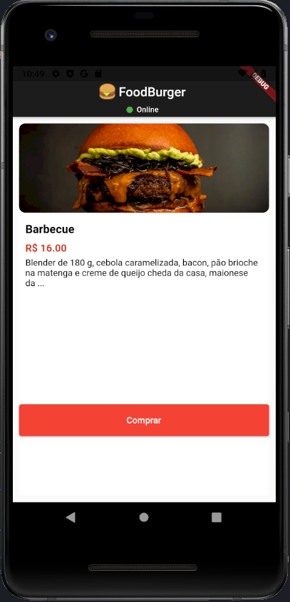

<h1 align='center'>foodburger</h1>

App de uma hambúrgeria ficticia * Desenvolvido para a disciplina mobile

 

  

    
    
  

### Prototipo
https://www.figma.com/proto/BGV70wYokFAPSb3F6uGPRG/AppDisciplina?page-id=0%3A1&node-id=2%3A4&starting-point-node-id=2%3A4&scaling=scale-down
